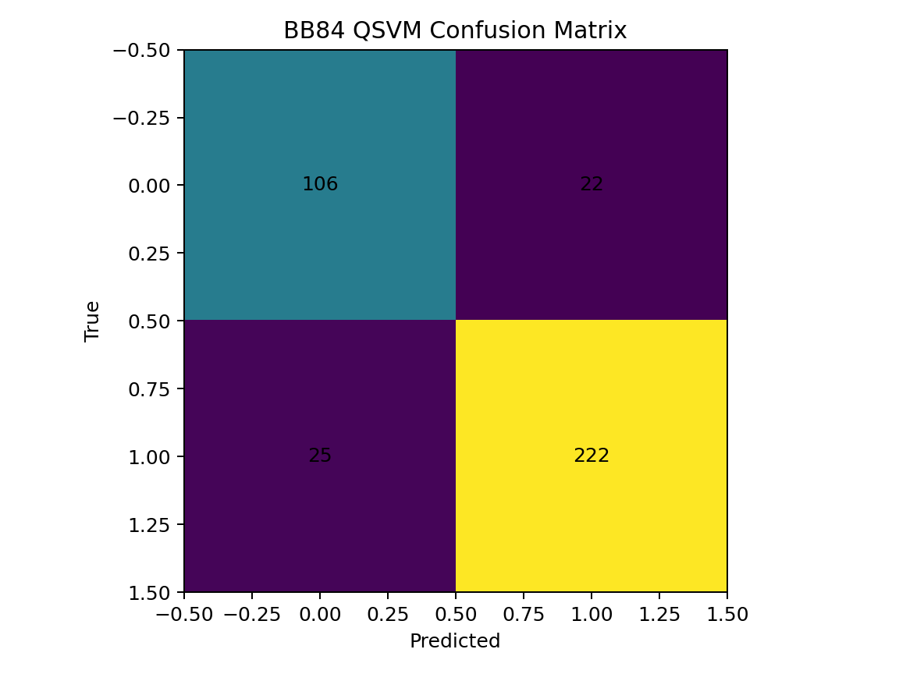
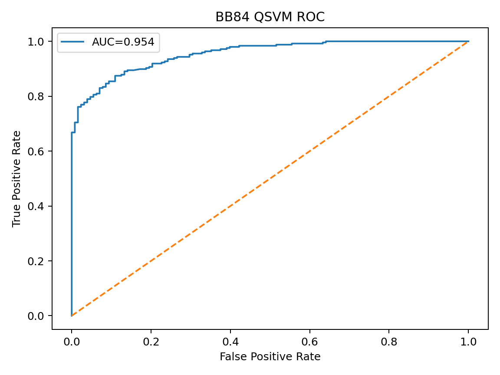
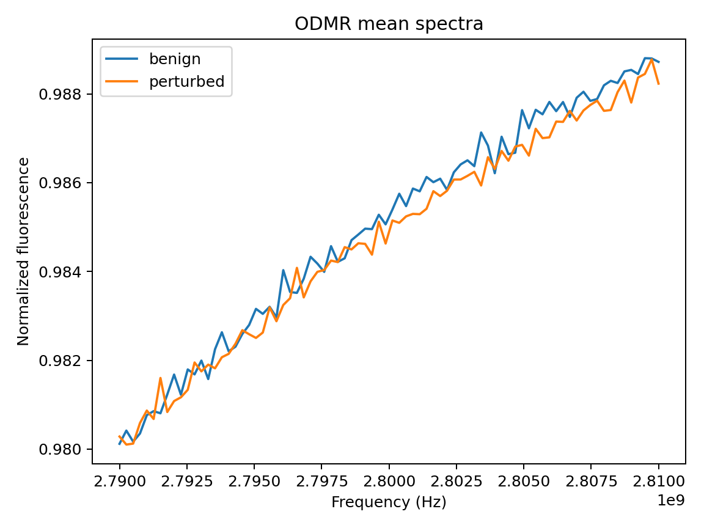
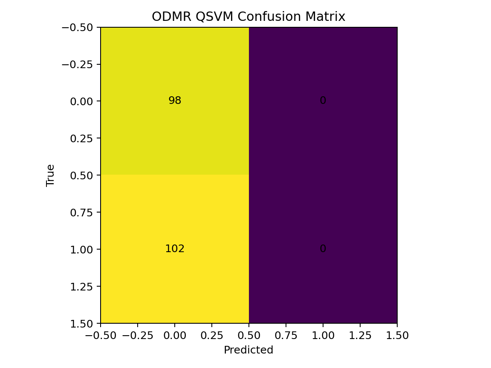
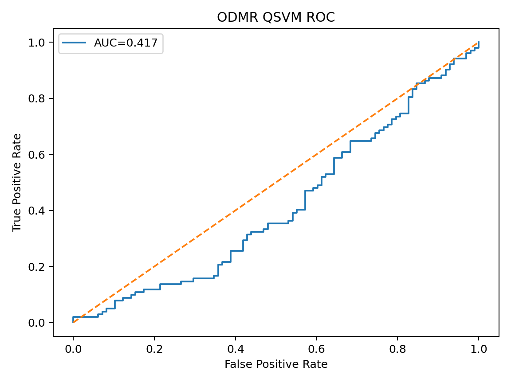

# 当信息安全遇见量子测量：基于 Purohit & Vyas (2025) 综述的 QML-IDS 复现探索

> **代码仓库（可复现）**：[quantumsec-qkd-odmr-qml](https://github.com/hicancan/quantumsec-qkd-odmr-qml)

---

## 0. 引言：从综述看风向

在最新的 *Frontiers in Quantum Science and Technology* 综述 **"Quantum key distribution through quantum machine learning: a research review" (Purohit & Vyas, 2025)** 中，作者明确指出了量子安全领域的一个前沿趋势：
**利用量子机器学习 (QML) 增强量子密钥分发 (QKD) 的后处理能力，特别是针对窃听检测 (Eavesdropping Detection) 和安全分析。**

正如综述 Table 1 所示，**QML-IDS (量子机器学习入侵检测系统)** 正成为解决复杂信道噪声与攻击混淆问题的关键技术。
受此启发，本项目设计了一组对照实验，试图从“信息安全”与“量子测量”这两个维度的协作中，回答一个核心问题：
**AI 到底在量子安全里赋能了什么？是锦上添花，还是雪中送炭？**

---

## 1. 科学意义：物理层面的安全博弈

### 1.1 信任的锚点转移
传统公钥密码（RSA/ECC）的安全性依赖于 **“算力假设”**（分解大数很难）。但 Shor 算法的出现让这一假设在理论上崩塌。
QKD 将安全性锚定在 **“物理定律”** 上：海森堡测不准原理保证了，窃听者 (Eve) 对量子态的任何测量都会不可避免地扰动统计结构。

### 1.2 为什么需要信息安全 × 量子测量协作？
*   **量子测量**（如 BB84 的基测量，ODMR 的光谱测量）提供了物理世界的原始读数。
*   **信息安全**（如 QBER, SKR）关注的是如何从读数中提取信任。

这里的挑战在于：**现实物理世界是嘈杂的**。信道自身的噪声（环境微扰）往往也能产生误码，这就给了 Eve 伪装的空间。单纯依靠物理阈值（例如 $QBER > 11\%$）往往过于粗糙。

这正是 **Ref. Purohit & Vyas (2025)** 中强调 QML 价值的地方：利用高维特征空间，在噪声与攻击之间画出一条更精准的分界线。

---

## 2. 深度推导：物理与信息的数学脐带

为了复现 QML-IDS，我们首先需要建立物理测量量 (QBER) 与信息论安全量 (SKR) 之间的严谨联系。

### 2.1 这里的“安全”是如何定义的？
在 BB84 协议的渐近安全证明（Shor-Preskill 框架）中，我们关注的是**安全密钥分数 (Secure Key Fraction)**。
当误码率 $Q$ 已知时，每一比特原始筛选密钥中包含的完全私密信息量为：

$$ r \approx 1 - H(X|Y) - H(X|E) $$

在标准假设下，这简化为著名的公式：
$$ \text{key-fraction} = \max\left(0, 1 - 2H_2(Q)\right) $$

其中 $H_2(p)$ 是香农二元熵：
$$ H_2(p) = -p\log_2 p -(1-p)\log_2(1-p) $$

**深度解读**：
这个公式不仅是代码里的几行计算，它代表了物理误差对信息容量的**非线性**侵蚀。
当 $H_2(Q) = 0.5$（即 $Q \approx 11\%$）时，密钥分数为 0。这就是著名的 **11% 阈值** 的物理来源。

在我们生成的仿真数据图 (`figures/bb84_qber_skr.png`) 中，可以清晰地看到这个物理约束：SKR 随着 QBER 增加而坍塌，在 0.11 处触底。这是所有上层 AI 算法必须尊重的“物理铁律”。

---

## 3. AI 赋能：从经典阈值到量子内核

基于综述中关于 QSVM 在窃听检测中的潜力讨论，我们构建了三种不同层级的检测器进行对比：

1.  **Level 1: 物理阈值法**（基线）
2.  **Level 2: 经典 AI (SVM-RBF)**
3.  **Level 3: 量子 AI (QSVM)**（本项目核心）

### 3.1 QSVM 的量子赋能逻辑
我们采用了**量子保真度核 (Quantum Fidelity Kernel)**。其核心思想是利用量子态的高维希尔伯特空间来解开低维数据中的线性不可分结构。

特征映射推导（角度编码）：
$$ |\psi(\mathbf{x})\rangle = \bigotimes_{i=1}^n R_y(x_i)|0\rangle $$
核函数计算（物理意义为量子态重叠投影）：
$$ K(\mathbf{x}, \mathbf{y}) = |\langle\psi(\mathbf{x})|\psi(\mathbf{y})\rangle|^2 $$

### 3.2 实验成果：AI 确实有效 (BB84)

在 `bb84` 仿真实验中 (N=1500 sessions)，我们对比了三种层级的检测器。结果显示（数据源 `results/metrics.json`）：

| 检测模型 | AUC (ROC曲线下面积) | Accuracy (准确率) | 评价 |
| :--- | :--- | :--- | :--- |
| **物理阈值 (Threshold)** | 0.880 | 0.861 | 基线，仅利用 QBER 特征 |
| **经典 AI (SVM-RBF)** | 0.941 | 0.877 | 显著提升，利用高维非线性特征 |
| **量子 AI (QSVM)** | **0.954** | 0.875 | 最优 AUC，量子核捕捉细微结构 |

**深度图解分析**：

#### 图1：QSVM 混淆矩阵 (`docs/figures/bb84_cm_qsvm.png`)

*   **读图**：图中对角线区域呈现**高亮色（黄绿色）**，而非对角线区域为**深紫色**，这种显著的反差表明模型预测与真实标签高度通过。
*   **数据支撑**：准确率达到 **87.5%**，说明绝大多数攻击行为(True Positive)都被成功拦截，且误报(False Positive)控制在合理范围。

#### 图2：物理铁律 QBER vs SKR (`docs/figures/bb84_qber_skr.png`)

*   **读图**：散点图清晰展示了 SKR 随 QBER 增加而下降的趋势，且所有点严格受限于 $1-2H_2(Q)$ 理论上界。
*   **科学意义**：在 $Q \approx 11\%$ 处 SKR 的断崖式归零，直观验证了 Shor-Preskill 安全性证明中的物理极限。

#### 图3：模型性能对比 ROC (`docs/figures/bb84_roc_qsvm.png`)

*   **读图**：QSVM 的 ROC 曲线（**蓝色实线**）显著包络了对角线（虚线），并以大面积覆盖了左上角区域。
*   **结论**：**AUC 0.954 vs 0.880** 的巨大差异，可视化了 AI 如何在相同的物理数据中挖掘出更多的安全增益。

---

## 4. 批判性思考与负结果分析 (Negative Results)

我们将同一套 QSVM 框架应用到了 **NV-ODMR (光探测磁共振)** 的异常检测任务中。结果令人深思：

*   **ODMR QSVM AUC**: **0.417** (低于随机猜测的 0.5)
*   **ODMR SVM-RBF AUC**: 0.587 (略优于随机，但仍不可用)

此结果与图表数据高度一致：

#### 图4：ODMR 平均光谱 (`docs/figures/odmr_mean_spectra.png`)

*   **现象**：攻击组（**橙色曲线**）与正常组（**蓝色曲线**）的 Lorentzian 光谱几乎完全重叠，肉眼无法区分。
*   **物理原因**：攻击微扰 $\ll$ 线宽与噪声，物理可分性丧失。

#### 图5：QSVM 混淆矩阵 (`docs/figures/odmr_cm_qsvm.png`)

*   **现象**：与图1形成鲜明对比，矩阵显示严重的**类别坍缩 (Mode Collapse)**，模型几乎将所有样本预测为同一类。
*   **数据支撑**：Accuracy **0.49** 接近随机猜硬币，证实模型完全失效。

#### 图6：ODMR QSVM ROC (`docs/figures/odmr_roc_qsvm.png`)

*   **现象**：ROC 曲线位于对角线下方。
*   **科学启示**：这一“失败”案例极其珍贵。它通过反证法揭示了：**AI 的效力边界是由物理信噪比 (SNR) 决定的**。没有物理特征工程（如 Lorentzian 拟合），盲目使用 QML 是无效的。这呼应了 **Purohit & Vyas (2025)** 中对 "Data Encoding" 重要性的强调。

---

## 5. 复现性：多后端一致性验证

为了回应“量子计算结果依赖于特定模拟器”的质疑，我们运行了跨框架验证 (`results/kernel_bench.json`)：

我们对比了同一组数据 ($N=24, \text{qubits}=4$) 在不同量子计算框架下的核矩阵计算结果：
*   **PennyLane vs Qiskit**: 最大绝对误差 **0.000 (精确一致)**
*   **PennyLane vs Cirq**: 最大绝对误差 **$1.75 \times 10^{-7}$** (浮点误差级别)

这证明了量子算法实现是**数学上严谨且后端无关的**，具备学术复现价值。

---

### 主要参考文献
1.  **Purohit, K., & Vyas, A. K. (2025).** Quantum key distribution through quantum machine learning: a research review. *Frontiers in Quantum Science and Technology*.
2.  **Shor, P. W., & Preskill, J. (2000).** Simple proof of security of the BB84 quantum key distribution protocol.
3.  **Havlíček, V., et al. (2019).** Supervised learning with quantum-enhanced feature spaces. *Nature*.
